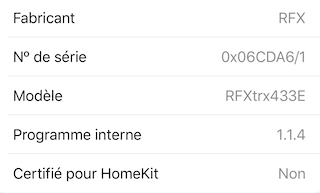
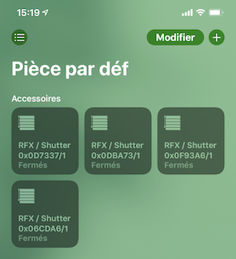

# homebridge-rfx-shutter

[](https://www.npmjs.com/package/homebridge-rfx-shutter)

> Homebridge plugin for shutters controlled by RFXtrx433(E) transceivers.

### Warning

`v1.x.x` version of this plugin have issues with latest `rfxcom` versions (at least > `2.0.2`). The multiple accessories model fire multiple `listRemotes` (one for each accessory defined on your config file) that overwhelm the transceivers. `v2.x.x` use platform model that prevent this issue.

@see [V1 Readme file](V1_README.md) for `v1.x.x` usage.

### Install

```bash
npm i -g homebridge-rfx-shutter
```

### Usage

In your `~/.homebridge/config.json` on the `platform` part add your shutter using the following example:

```json
    {
      "platform": "RFXShutterDynamicPlatform",
      "tty": "/dev/ttyUSB0",
      "openSeconds": 20,
      "closeSeconds": 20,
      "excludedDeviceIds": ["0x0D7337/1"]
    }
```

- `tty` is the device "teletype" that can be found using `find-rfxcom` [rfxcom utility script](https://github.com/rfxcom/node-rfxcom#utility-scripts).
- `openSeconds` / `closeSeconds` are optionals, by default they are set to `25` for opening and `22` seconds for closing.
- `excludedDeviceIds` option can be used to remove any shutter or "shutter group" to the platform. The device id of the shutter is provided in the accessory information, see below:



### Release

```bash
yarn version
yarn build
yarn publish dist --access public
```
